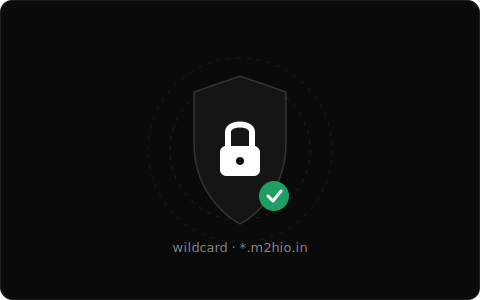
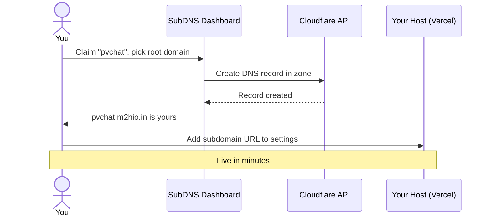

<div align="center">
  
  <h1 align="center">SubDNS</h1>
  <p align="center">
    <strong>Free subdomain management platform powered by Cloudflare</strong>
  </p>
  <p align="center">
    <a href="https://subdns.m2hio.in">Live Demo</a> ·
    <a href="docs/tutorials/getting-started.md">Getting Started</a> ·
    <a href="https://subdns.m2hio.in/docs">Documentation</a> ·
    <a href="CONTRIBUTING.md">Contributing</a>
  </p>
  <p align="center">
    
    
    
    
  </p>
</div>

---

## What is SubDNS?

SubDNS gives you free subdomains under configurable root domains (e.g. `m2hio.in`, `your-domain.io`) — no credit card, no domain purchase, no Cloudflare access needed. Claim a subdomain, pick your root domain, add the URL to your hosting provider (Vercel, Netlify, Railway, etc.), and you're live.

### How It Works



**Key insight:** SubDNS handles the DNS. You register the URL on your hosting provider.

---

## Features

### 🆓 Free Subdomains
Claim unlimited subdomains across multiple root domains at zero cost. No credit card required.

### 🌐 Cloudflare Powered
DNS records are created via Cloudflare API across multiple zones — automatic SSL, DDoS protection, and global CDN.

### 🖥️ Web Dashboard
Manage everything from a beautiful, dark-mode dashboard inspired by Vercel and Linear.

### 🌐 Root Domain Selection
Admins can add multiple root domains; users choose which one to use when creating a subdomain.

### ⌨️ CLI Tool
Manage subdomains from your terminal with `@subdns/cli`.

### 🔌 REST API
Programmatic access for CI/CD pipelines and automation.

### 📋 DNS Record Types
Full DNS support: A, AAAA, CNAME, TXT, MX, SRV, CAA records.

### 🔒 SSL Automatic
Every proxied subdomain gets automatic SSL certificates via Cloudflare.

### 📊 Activity Logging
Full audit trail of every action — who did what and when.

---

## Quick Start

```bash
# Via web dashboard
# 1. Go to https://subdns.m2hio.in
# 2. Sign up and verify your email
# 3. Click "New Subdomain"
# 4. Pick a root domain (e.g. m2hio.in), and enter name + target
# 5. Done! Add your-subdomain.<domain> to your hosting provider

# Or via CLI
npm install -g @subdns/cli
subdns login YOUR_API_KEY
subdns claim myapp --target myapp.vercel.app --domain m2hio.in
```

📖 **Full tutorial:** [Getting Started Guide](docs/tutorials/getting-started.md)

---

## Supported Platforms

| Platform | Instructions |
|----------|-------------|
| [Vercel](https://vercel.com) | Settings → Domains → Add your subdomain URL |
| [Netlify](https://netlify.com) | Site Settings → Domain Management → Custom Domains |
| [Railway](https://railway.app) | Settings → Custom Domains → Add your subdomain URL |
| [GitHub Pages](https://pages.github.com) | Repo Settings → Pages → Custom domain |
| [Cloudflare Pages](https://cloudflare.com) | Custom Domains → Set up custom domain |
| [Fly.io](https://fly.io) | `flyctl certs create your-subdomain.<domain>` |
| [Render](https://render.com) | Settings → Custom Domain → Add your subdomain URL |
| [Koyeb](https://koyeb.com) | App Settings → Domains → Add Domain |
| [Heroku](https://heroku.com) | `heroku domains:add your-subdomain.<domain>` |

📖 **Full guide:** [Platform Guide](docs/tutorials/platform-guide.md)

---

## CLI Usage

```bash
# Installation
npm install -g @subdns/cli

# Commands
subdns login <api-key>        # Authenticate
subdns claim <name> [options] # Claim a subdomain
subdns list                   # List your subdomains
subdns info <name>            # Show subdomain details
subdns release <name>         # Delete a subdomain
subdns dns add <name>         # Add a DNS record
subdns dns rm <id>            # Remove a DNS record
subdns logs                   # View activity logs
subdns logout                 # Remove stored API key
```

📖 **Full guide:** [CLI Guide](docs/tutorials/cli-guide.md)

---

## API

```bash
curl -X POST https://subdns.m2hio.in/api/subdomains \
  -H "Authorization: Bearer YOUR_API_KEY" \
  -H "Content-Type: application/json" \
  -d '{"name": "myapp", "target": "myapp.vercel.app"}'
```

📖 **API Reference:** Available at [subdns.m2hio.in/docs/api](https://subdns.m2hio.in/docs/api)

---

## Tech Stack

| Layer | Technology |
|-------|-----------|
| **Framework** | Next.js 16 (App Router) |
| **UI** | React 19 + Tailwind CSS v4 |
| **Auth** | next-auth (credentials, JWT) |
| **Database** | PostgreSQL + Supabase |
| **DNS** | Cloudflare API (multi-zone) |
| **Cache** | Upstash Redis (with in-memory fallback) |
| **CLI** | Commander.js + chalk |
| **Deployment** | Docker, docker-compose |

---

## Project Structure

```
subdns/
├── cli/                 # CLI tool (@subdns/cli)
│   └── src/             # TypeScript source
├── docs/                # Documentation
│   └── tutorials/       # Getting started, platform guides
├── prisma/              # Database schema & migrations
├── public/              # Static assets & card images
├── src/
│   ├── app/             # Next.js App Router
│   │   ├── (static)/    # Landing page, features, pricing
│   │   ├── admin/       # Admin panel
│   │   ├── api/         # REST API routes
│   │   ├── auth/        # Login & registration
│   │   ├── dashboard/   # User dashboard
│   │   └── docs/        # Documentation pages
│   ├── components/      # React components
│   │   ├── dashboard/   # Dashboard UI components
│   │   ├── landing/     # Landing page components
│   │   └── ui/          # Reusable UI primitives
│   ├── lib/             # Core libraries
│   └── types/           # TypeScript type definitions
└── SubDNS/              # Obsidian vault (dev notes)
```

---

## Local Development

```bash
# Prerequisites: Node.js 20+, PostgreSQL 16+
git clone https://github.com/prince-m2hgamerz/subdns.git
cd subdns
npm install
cp .env.example .env.local   # Fill in your credentials
npx prisma migrate dev
npm run dev                  # http://localhost:3000
```

---

## Docker Deployment

```bash
docker-compose up -d
```

This starts PostgreSQL + the SubDNS app on port 3000.

---

## Contributing

We welcome contributions! Please see [CONTRIBUTING.md](CONTRIBUTING.md) for details.

- [Code of Conduct](CODE_OF_CONDUCT.md)
- [Bug Reports](.github/ISSUE_TEMPLATE/bug_report.md)
- [Feature Requests](.github/ISSUE_TEMPLATE/feature_request.md)
- [Security Policy](SECURITY.md)

---

## License

[MIT](LICENSE) © 2026 [m2hio](https://github.com/prince-m2hgamerz)

---

## Show Your Support

- ⭐ Star the repo
- 🐛 [Report bugs](https://github.com/prince-m2hgamerz/subdns/issues)
- 💡 [Suggest features](https://github.com/prince-m2hgamerz/subdns/issues)
- 📢 Share with your developer friends
