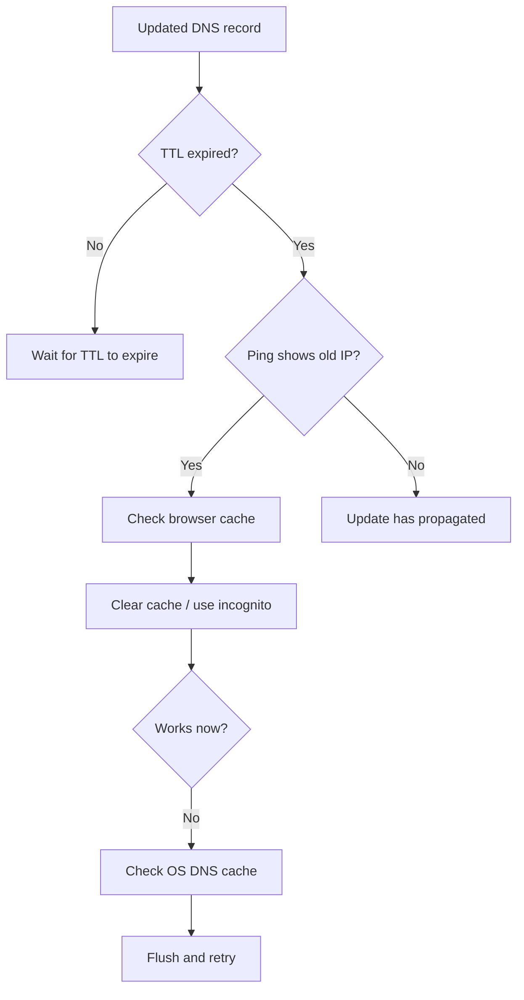

# DNS Propagation & TTL: Understanding Delays

You update your DNS record... and nothing happens. Your site is still pointing to the old server. What is going on? This guide explains the invisible system that controls when your changes go live.

---

## What Is DNS Propagation?

DNS propagation is the time it takes for DNS changes to spread across the global internet.

When you create or update a DNS record in SubDNS, the change is instant on our nameservers. But the rest of the internet uses **cached** DNS data. Recursive resolvers (Google DNS, Cloudflare's 1.1.1.1, your ISP's DNS server) keep cached copies of your old records until they expire.

**Until the cache expires, some visitors will see the old IP address while others see the new one.**

---

## TTL: Time To Live

TTL is the instruction you give to DNS resolvers telling them how long they should keep a record cached before checking for an update.

### How TTL Works

```
You create A record with TTL 3600 (1 hour)
        ↓
SubDNS nameservers respond with: "example.com → 192.0.2.1, cache for 3600 seconds"
        ↓
Google DNS (8.8.8.8) caches the result
        ↓
For the next hour, every query to Google DNS returns the cached IP
        ↓
After 3600 seconds, Google DNS re-queries SubDNS
```

### TTL Recommendations

| Scenario | Recommended TTL | Why |
|----------|----------------|-----|
| Migration or setup | 300 (5 min) | Allows fast rollback if something breaks |
| Production website | 3600 (1 hour) | Balances performance with update speed |
| High-traffic site | 86400 (24 hours) | Maximizes caching, reduces DNS costs |
| Load-balanced service | 60 (1 min) | Quick failover between servers |
| Emergency change | 60 (1 min) | Must be set BEFORE the emergency |

### Best Practice: Stage Your TTL Reductions

**Rule:** If you might need to change a record, lower the TTL **days in advance**.

This is the most common DNS mistake:

```
❌ Day 1: Change TTL to 300 and update A record → wait 5 minutes
✅ Day 1: Change TTL to 300 → propagate for 24 hours
✅ Day 2: Update A record → propagates in 5 minutes
```

---

## How Long Does Propagation Actually Take?

| Factor | Typical Range |
|--------|---------------|
| TTL setting | You control this (5 min to 24 hours) |
| Recursive resolver | Seconds to hours (Google/Cloudflare update quickly, ISP resolvers are slow) |
| Browser DNS cache | 1-60 minutes (Chrome has its own DNS cache) |
| OS DNS cache | Seconds to 15 minutes |
| CDN edge caches | Minutes to hours |

### Real-World Propagation Times

- **TTL = 300** (5 min): Most resolvers update within 1-10 minutes
- **TTL = 3600** (1 hour): Most resolvers update within 30-90 minutes
- **TTL = 86400** (24 hours): Some resolvers may take 24-48 hours

---

## Checking Propagation Status

### Using dig (macOS/Linux/WSL)

```bash
# Check a specific resolver
dig @8.8.8.8 your-subdomain.m2hio.in

# Check the authoritative answer (bypass cache)
dig your-subdomain.m2hio.in +trace | grep "m2hio.in"
```

### Using nslookup (Windows)

```bash
nslookup your-subdomain.m2hio.in 8.8.8.8
```

### Online Tools

- **whatsmydns.net** — Global propagation checker (shows status in 20+ locations)
- **dnschecker.org** — Similar to above with more test types
- **DNSPerf** — DNS resolver performance comparisons

### Verify HTTPS After Propagation

```bash
curl -vI https://your-subdomain.m2hio.in 2>&1 | grep -E "(HTTP/|SSL|Server)"
```

---

## Propagation FAQ

### Why is my site still showing the old content?

1. **Browser cache:** Clear your browser cache (Ctrl+Shift+Del in most browsers) or open in incognito/private mode
2. **OS DNS cache:** Run `ipconfig /flushdns` (Windows) or `sudo dscacheutil -flushcache` (macOS)
3. **TTL hasn't expired:** Wait the full TTL duration
4. **Cloudflare proxy:** If your record is proxied (orange cloud), you may also need to purge the Cloudflare cache

### Why do different locations show different IPs?

This is normal during propagation. Resolvers that queried before your change will return the old IP. Resolvers that queried after your change return the new IP. The window varies based on TTL.

### Can I speed up propagation?

You cannot force every resolver to flush their cache. But you can:
- Use a low TTL (300) before making changes
- Purge Cloudflare cache for proxied records
- Flush local caches (browser, OS)
- Use SubDNS's instant update feature

---

## Proxied Records & Cache

When you use Cloudflare proxy (orange cloud), there is an additional cache layer:

```
Visitor → Cloudflare CDN Cache → Cloudflare Proxy → Your Origin
```

**Cloudflare cache** is separate from DNS cache. Even after DNS propagates, Cloudflare may serve stale cached content. You can purge this from the domain dashboard or set caching rules.

---

## Troubleshooting Slow Propagation



---

## Related Guides

- [DNS Management](./dns-management.md) — Updating records in the dashboard
- [Troubleshooting DNS Issues](./troubleshooting-dns-issues.md) — Fix common problems
- [Cloudflare Proxy Guide](./cloudflare-proxy-ssl-guide.md) — Understanding proxy behavior
